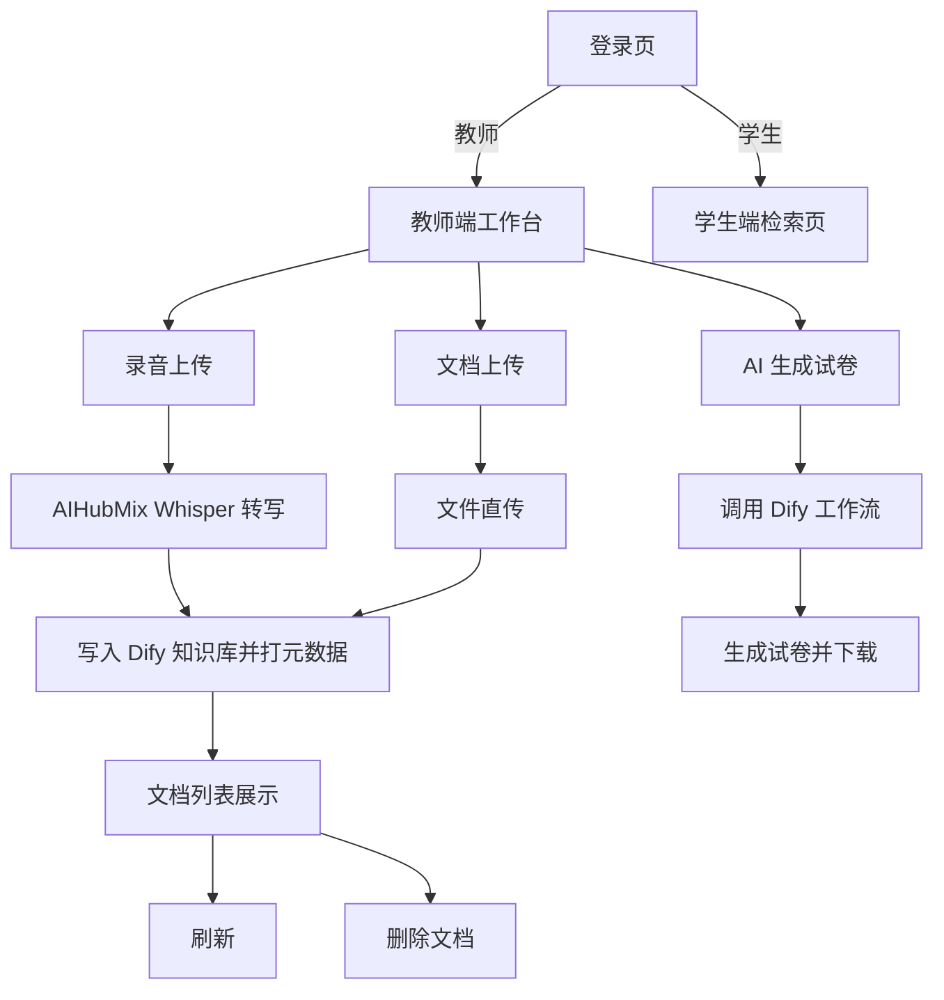

## 1. Product Overview
一个教学资源知识库管理系统：支持教师端上传录音/文档并写入 Dify 知识库，为每个文件打上「学科/第几周」元数据，提供文档列表管理与 AI 自动生成试卷功能；学生端提供基于 AI 的对话式复习助手，支持 Markdown 渲染与思维导图生成。系统通过登录页区分教师与学生身份，整体采用 indigo 紫蓝学院风设计。

## 2. Core Features

### 2.1 Feature Module
本产品需求由以下页面组成：
1. **登录页**：教师/学生身份切换登录，支持记住密码，不开放注册。indigo 渐变配色。
2. **教师端 — 知识库工作台**：录音上传（自动转写入库）、文档上传（直接入库）、元数据填写（学科/第几周）、文档列表查看与删除、AI 生成试卷并下载。
3. **学生端 — AI 复习助手**：Landing 英雄首页 + 滑入式聊天界面；支持多轮对话、Markdown 渲染、Mermaid 思维导图/流程图；对话历史本地持久化。

### 2.2 Page Details
| Page Name | Module Name | Feature description |
|---|---|---|
| 登录页 | 身份选择 | 通过 Segmented 切换「学生登录」与「教师登录」；输入学号/工号与密码；支持「记住密码」复选框（localStorage 持久化）。 |
| 登录页 | 本地验证 | 目前使用本地 mock 数据验证（student1/123456、teacher1/123456），后续可接入后端身份验证服务。 |
| 教师端工作台 | 录音上传 | 选择录音文件（mp3/wav/m4a/webm 等，≤25MB）；服务端调用 AIHubMix Whisper 转写为文本，携带元数据写入 Dify 知识库；展示上传进度与成功/失败提示。 |
| 教师端工作台 | 文档上传 | 选择文档文件（pdf/docx/txt/md/xlsx/csv/html，≤100MB）；直接以文件形式写入 Dify 知识库；展示上传结果。 |
| 教师端工作台 | 元数据填写 | 为每个待上传文件填写「学科」（必填，文本输入）与「第几周」（必填，数字输入 1–30）；提交前进行必填校验。 |
| 教师端工作台 | 文档列表 | 展示已入库文件列表（文件名/上传时间/索引状态）；支持刷新；支持删除单个文件（弹出确认框后调用 Dify API 删除）。 |
| 教师端工作台 | AI 生成试卷 | 点击「生成试卷」按钮 → 弹窗填写学科与周数范围（起始周–结束周） → 调用 Dify 工作流生成试卷 → 自动下载到本地。 |
| 学生端 | Landing 首页 | 全屏英雄页：indigo 渐变背景、旋转 SVG 几何装饰（鼠标跟随+涟漪）、「开始复习」入口按钮。 |
| 学生端 | AI 对话 | 多轮对话（基于 Dify Chat API）；AI 回复支持 Markdown 全格式渲染；代码块 language=mermaid 自动渲染为思维导图/流程图；对话历史存储于 localStorage。 |
| 学生端 | 对话管理 | 左侧边栏展示历史对话列表；支持新建对话、切换对话、删除对话。 |

## 3. Core Process
**登录流程**：打开系统 → 选择身份（学生/教师） → 输入账号密码 → 验证通过 → 跳转至对应端页面。

**上传录音流程**：教师登录 → 切换到录音上传 → 选择音频文件 → 填写学科与第几周 → 提交 → 服务端 Whisper 转写 → 文本写入 Dify 知识库 → 列表可见。

**上传文档流程**：教师登录 → 切换到文档上传 → 选择文件 → 填写学科与第几周 → 提交 → 文件写入 Dify 知识库 → 列表可见。

**删除文档流程**：在文档列表找到目标文件 → 点击删除按钮 → 确认弹窗 → 调用 Dify API 删除 → 列表实时移除。

**生成试卷流程**：教师点击「生成试卷」 → 弹窗填写学科与周数范围 → 调用后端 Dify 工作流接口 → 生成试卷内容 → 自动下载 .txt 文件到本地。

**学生 AI 对话流程**：学生登录 → Landing 首页「开始复习」→ 聊天页面滑入 → 输入问题 → 调用后端 Dify Chat API → AI 回复（支持 Markdown/Mermaid）→ 对话记录自动保存。

